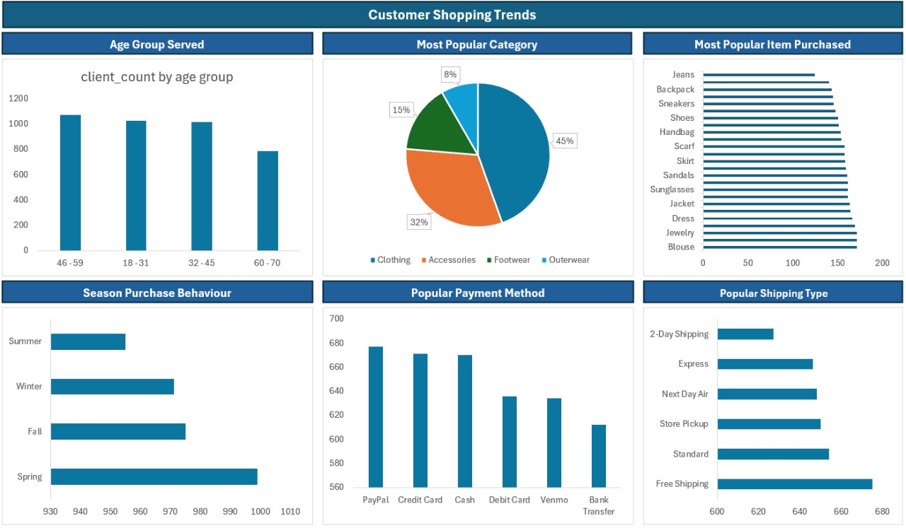

# 🛍️ Retail Sales Analysis - Excel & SQL Project

📈 This project showcases a **Retail Sales Analysis** dashboard created using **Microsoft Excel**, with data prepared and cleaned using **SQL**.  
It provides a deep dive into sales trends, top-performing categories, and store performance across different regions.

---

## 📁 Files & Folders Included

| Name                      | Description                                       |
|---------------------------|---------------------------------------------------|
| `SQL Scripts/`            | Folder containing SQL scripts for data cleaning   |
| `DATA Exported by sql/`        | CSV/Excel files exported from SQL after transformation        |
| `shopping_trends_updated.csv`         | Raw retail sales dataset                          |
| `DASHBOARD.jpg`           | Screenshot of the Excel dashboard                 |

---

## 📊 Dashboard Features

- 📌 Total sales by **category**, **region**, and **month**
- 📌 Visuals: **Bar charts**, **Line charts**, **Pie charts**, and KPIs
- 📌 **Slicers** for dynamic filtering (e.g. category, store)
- 📌 **Conditional formatting** to spot trends, declines, and outliers

---

## 🛠 Tools & Techniques Used

| Tool            | Use Case                                      |
|-----------------|-----------------------------------------------|
| 🟩 Microsoft Excel | Creating dashboards, charts                  |
| 🗃️ SQL      | Data cleaning and preparation                |
| 📈 Charts         | Visual representation of metrics              |
| 🎨 Formatting     | Highlighting key data points                  |

---

## 🔍 Key Insights

✅ Identified **top-selling categories and products**  
✅ Uncovered **seasonal sales trends** across the year  
✅ Analyzed **regional and store-based performance**  
✅ Created a **dashboard** that helps in quick business decisions  

---

## 📌 Purpose of the Project

> 🎓 This project was completed as part of my **Data Analytics learning journey**, focusing on using **Excel & SQL** to deliver business insights from raw retail data.  
> It reflects my ability to extract, clean, analyze, and visualize data in a meaningful and professional way.

---

##  About Me

I'm **Omar Nasr**, an aspiring Data Analyst passionate about using **Excel, SQL, Python, and Power BI** to turn data into actionable insights.  
Check out more of my work on [GitHub](https://github.com/omar-nasr22) 🔗

---

⭐ If you found this project useful, feel free to give it a **star** and follow for more!
